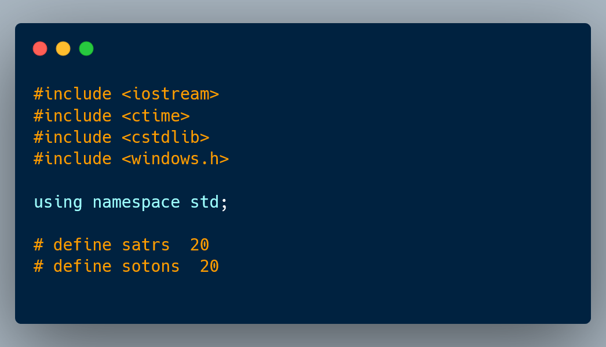

# Project description

We initialized a random city with any desired number of intersections, filling it with the marker ('-'). We then printed the city using the `p_city` function. Initially, we used the `srand()` function to randomly assign intersections ('#') in the city. We employed the `validmove` function to check the correctness of the vehicle's movement in a given direction, considering the city's constraints and intersections. After confirming a valid move, we used the `movecar` function to randomly relocate the vehicle to a new valid direction, placing it in the new location with the marker ('*') and removing the vehicle's previous markers from the old locations. We used the `printcity` function to print the city at each stage of the simulation. The `main` function takes input, creates vehicles at random locations in the city, and moves them in each step using the `movecar` function. We also utilized the `clearscreen` function to clear the screen before printing the city in each stage, and the `sleep` function was used to pause the program for a short period to better observe the vehicle movements.

# Description of different parts of the code

 * define constants are defined with `values of 20`. These constants are used to define the dimensions of the city array.

>

 * The `ClearScreen()` function is one that clears the console screen.

>

 * The city_p() function initializes the city array with dashes ('-') and randomly places a specified number of intersections, denoted by '#', in the city array
 
>
